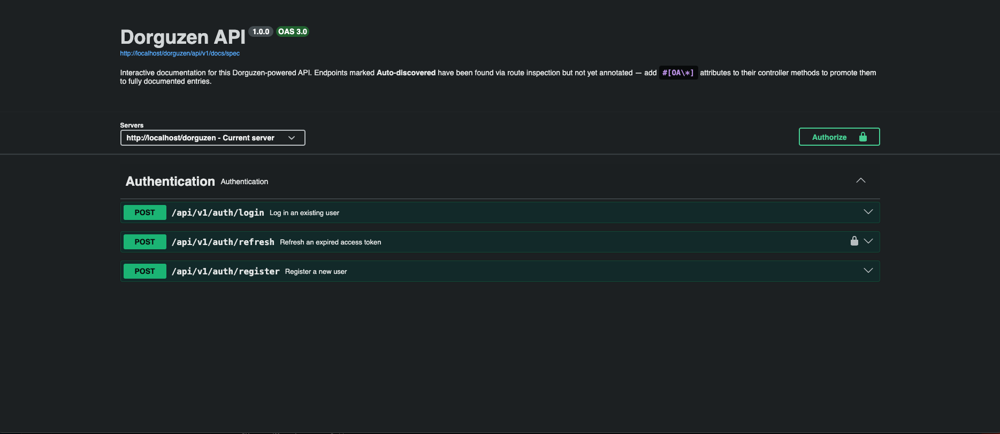

# Dorguzen Framework

### Powerful PHP Framework. No Black Box.

Dorguzen is a full-featured PHP MVC framework designed to give you everything you need to build fast, secure, and scalable web applications — without hiding how any of it works.

Most frameworks make development easier by wrapping PHP in layers of abstraction so thick that you end up learning the framework's own language (DSL) instead of PHP itself. Dorguzen takes a different approach: it keeps the ease, but strips away the abstraction. Every feature is built on straightforward PHP patterns with clear, teachable documentation that explains not just *what* to do, but *why*. The result is that a Dorguzen developer genuinely understands the architecture behind what they are building. That understanding is transferable — skills learned here apply directly to any PHP application, framework or not.

**Dorguzen does not just help you ship faster. It makes you a better PHP developer.**

Out of the box you get routing, controllers, models, views, an ORM, migrations, seeders, a CLI tool, built-in authentication, an admin dashboard, a REST API layer with interactive Swagger documentation, queues, events, scheduled tasks, and more.

---

## Requirements

- PHP >= 8.0
- Composer
- MySQL / MariaDB (or PostgreSQL / SQLite for alternative drivers)
- Apache with `mod_rewrite` enabled (or use the built-in development server — see below)

---

## Installation

Dorguzen is available on [Packagist](https://packagist.org/packages/gustocoder/dorguzen).

### Option A — Via Composer (recommended)

```bash
composer create-project gustocoder/dorguzen my-app
cd my-app
```

Replace `my-app` with your project folder name. Composer will pull the latest stable release from Packagist and install all dependencies automatically — no separate `composer install` step needed.

### Option B — Clone from GitHub

```bash
git clone https://github.com/gustavNdamukong/Dorguzen.git my-app
cd my-app
composer install
```

### 2. Set up your environment file

Dorguzen ships with `.env.example` as a template listing every variable the framework expects.

```bash
cp .env.example .env
```

Open `.env` and fill in the values for your local setup. At minimum, set:

```dotenv
APP_NAME=yourAppName
APP_URL=http://localhost/yourAppName

LOCAL_URL=http://localhost/yourAppName/
FILE_ROOT_PATH_LOCAL=/yourAppName/

DB_CONNECTION=mysqli
DB_HOST=127.0.0.1
DB_DATABASE=your_database_name
DB_USERNAME=your_db_user
DB_PASSWORD=your_db_password
DB_KEY=a-random-encryption-key
```

> `DB_KEY` is used to AES-encrypt password fields in the database. Choose any random string and keep it consistent — changing it after data has been inserted will break password verification.

See the **Setup & Config** section of `docs/dgzDocs.md` for the full list of available variables including mail, JWT, Stripe, Twilio, and module flags.

### 4. Create the database

Create a MySQL database matching the name you set in `DB_DATABASE`, then run the migrations:

```bash
php dgz migrate
```

This creates all the core tables (users, logs, jobs, SEO, contact form messages, etc.).

### 5. Seed the database

```bash
php dgz db:seed
```

This seeds the default super-admin account (see credentials below).

### 6. Point your web server at the project root

**Apache (MAMP / XAMPP / Laragon)**

Set the document root (or virtual host) so that `http://localhost/yourAppName` points to the project root directory containing `index.php`. Apache's `mod_rewrite` must be enabled and `AllowOverride All` must be set for the directory so that `.htaccess` is processed.

**Built-in PHP development server**

If you prefer not to configure Apache, Dorguzen ships with a `serve` command:

```bash
php dgz serve
```

This starts the app on `http://localhost:8000` by default. You can customise the port:

```bash
php dgz serve --port=9000
```

> The built-in server is suitable for local development only. Use Apache or Nginx in production.

---

## The dorguzapp Sample Application

Out of the box Dorguzen ships with **dorguzapp** — a ready-made application skeleton you can use as the starting point for your own project. All controllers, models, views, and routes are already wired up and working.

A standard user account is pre-configured in the sample app so you can log in immediately:

| Field    | Value                    |
|----------|--------------------------|
| Email    | dorguzen@dorguzen.com    |
| Password | dorguzen                 |

> Change these credentials once you start customising the app for your own project.

---

## Admin Dashboard

Dorguzen includes a built-in admin dashboard available at `/admin/dashboard` once you are logged in as a super-admin.

Out of the box the dashboard lets you:

- **Manage users** — view all registered accounts, change user roles, activate or deactivate accounts
- **Change your own username and password** — update your admin credentials from the profile screen
- **View contact form messages** — all messages submitted through your site's contact form are stored in the database and readable from the dashboard

The default super-admin account created by the seeder is:

| Field    | Value               |
|----------|---------------------|
| Email    | admin@dorguzen.com  |
| Password | Admin123            |

> Change these credentials immediately after your first login.

---

## Testing the API in the Browser

Dorguzen ships with interactive API documentation powered by OpenAPI and Swagger UI. No external tool is needed — visit the docs URL in any browser and you can read the full spec and fire live requests directly from the page.

**URL:**

```
http://localhost/yourAppName/api/v1/docs
```

Replace `yourAppName` with the value you set for `APP_NAME` in your `.env`.



The docs page lists every API endpoint, shows required inputs and expected responses, and includes an **Authorize** button where you can paste a JWT token to test protected routes.

To enable the docs, make sure your `.env` contains:

```dotenv
API_DOCS_ENABLED=true
```

This is the default for local development. For production, set it to `false` if your API is private, or leave it `true` if you are building a public developer-facing API.

---

## Running Tests

Dorguzen includes a PHPUnit test suite with a dedicated SQLite in-memory database so tests run fully isolated from your development database.

```bash
vendor/bin/phpunit
```

No separate database setup is needed — the test bootstrap handles everything automatically.

---

## CLI Reference

The `dgz` CLI tool handles migrations, seeders, code generation, the development server, and more. Run any command from your project root:

```bash
php dgz <command>
```

Common commands:

| Command                        | Description                              |
|-------------------------------|------------------------------------------|
| `php dgz migrate`             | Run all pending migrations               |
| `php dgz migrate:rollback`    | Roll back the last batch                 |
| `php dgz migrate:fresh`       | Drop all tables and re-run migrations    |
| `php dgz migrate:status`      | Show migration state                     |
| `php dgz db:seed`             | Run the database seeder                  |
| `php dgz make:model Name`     | Generate a model class                   |
| `php dgz make:migration name` | Generate a migration file                |
| `php dgz serve`               | Start the built-in development server    |

To see the full list of available commands:

```bash
php dgz list
```

---

## Documentation

Full developer documentation is in `docs/dgzDocs.md`. It covers routing, controllers, models, views, authentication, the ORM, migrations, seeders, queues, events, the REST API, SEO module, payments, and more.

---

## License

MIT
